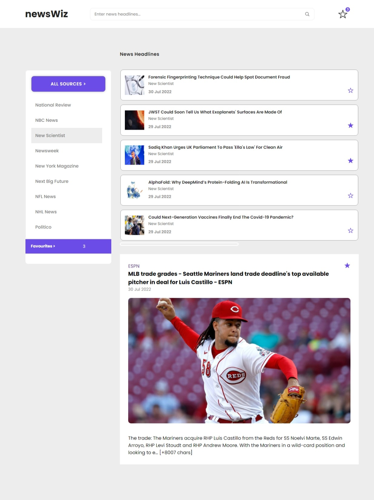
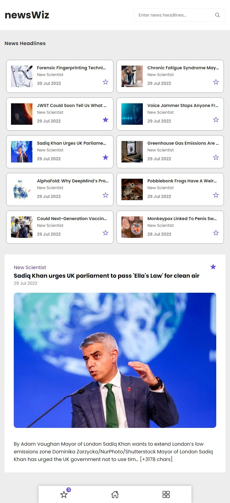
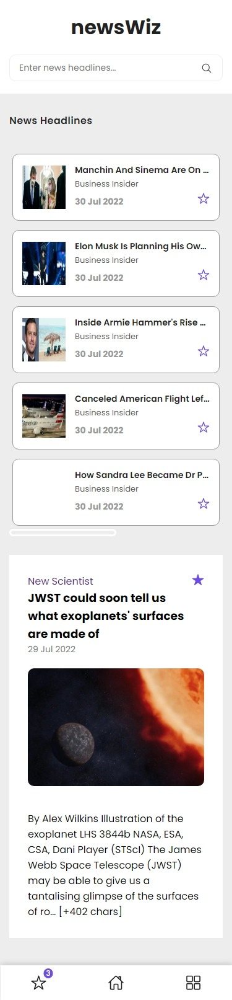

# newsWiz

## Video Demo

Link: https://youtu.be/eycMj_Af9To

Screenshot: 
  | Laptop View                            | Tab View                           |  Mobile View                    |
  | :-----------                           | :------------:                     |  ------------:                  |
  |  | | |
  |                                        |                                    |                                 |


## Description

- This project was bootstrapped with [Create React App](https://github.com/facebook/create-react-app).
-  NewsWiz is an news web application for all the news readers out there.
- It is made with vite.
- It gets you all the headlines from different news sources around the globe.

## In order to run this
- clone this repo using: `git clone` https://github.com/SHUBHAMspy/news-app.git.

- DO `npm install` in root directory of project on terminal to download all packages.
- Then write `npm start` to start the development server.

## Configuration
- Grab you api key from : https://newsapi.org. 
- Create a `.env` in your root directory.
- Store the api key in the file.
- Place the .env file in `.gitignore` if it is not already to ignore this from pushing. 

## Available Scripts

In the project directory, you can run:

### `npm start`

Runs the app in the development mode.\
Open [http://localhost:3000](http://localhost:3000) to view it in your browser.

The page will reload when you make changes.\
You may also see any lint errors in the console.

### `npm test`

- Launches the test runner in the interactive watch mode.\
- See the section about [running tests](https://facebook.github.io/create-react-app/docs/running-tests) for more information.

### `npm run build`

- Builds the app for production to the `build` folder.\
- It correctly bundles React in production mode and optimizes the build for the best performance.

- The build is minified and the filenames include the hashes.\
Your app is ready to be deployed!

- See the section about [deployment](https://facebook.github.io/create-react-app/docs/deployment) for more information.

### Global context and Provider

```
const initialState = {
  headlines:[],
  sources: [],
  newsToRead: {},
  favourites: localStorage.getItem("favourites")
    ? JSON.parse(localStorage.getItem("favourites"))
    : [],
};
```

-  Provider: To provide your global context to all the components.
```
function App() {
  
  return (
    <GlobalProvider >
      <Navbar/>
      {/* <h1> Hi Zap! Welcome to Vite + React</h1> */}
      <NewsSection/>
      <MobileNavbar visibility={true}/>
    </GlobalProvider>
  )
}
```